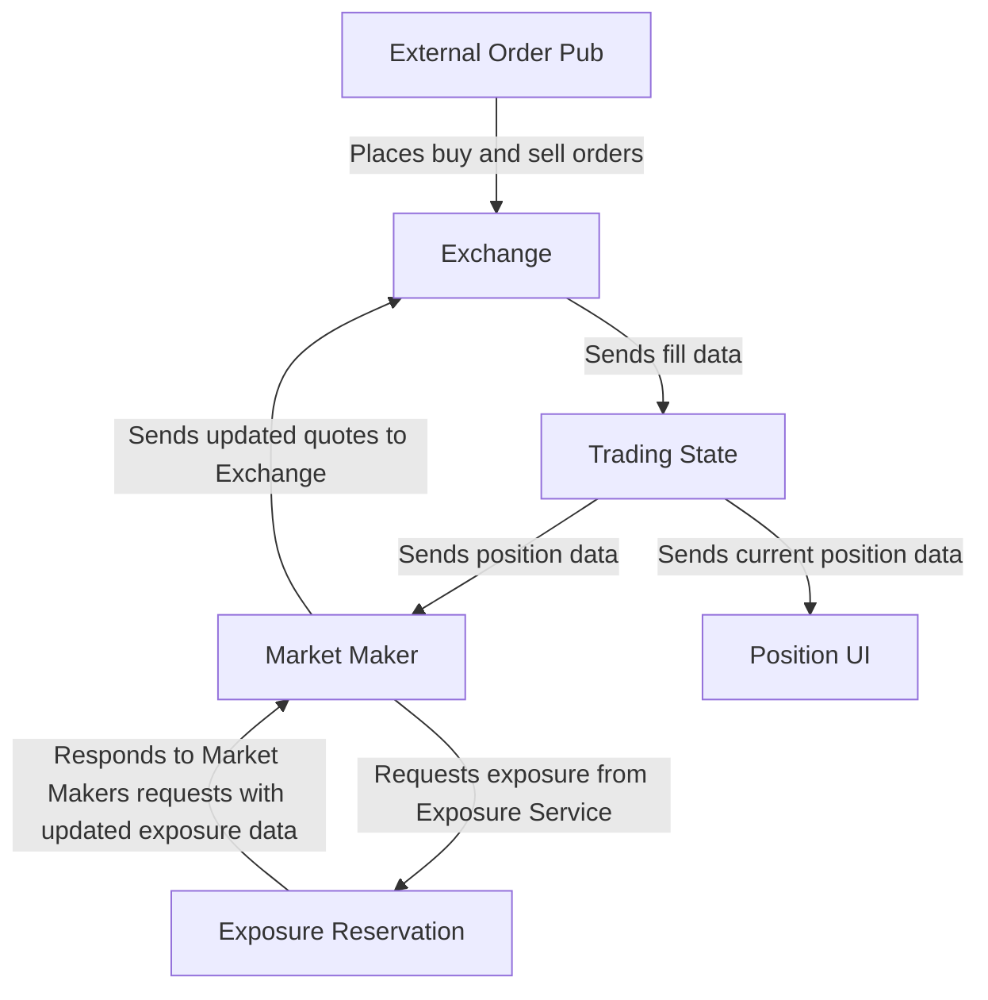

# Architecture

```mermaid
graph TD
    ExternalOrderPub["External Order Pub"]
    Exchange["Exchange"]
    TradingState["Trading State"]
    ExposureReservation["Exposure Reservation"]
    MarketMaker["Market Maker"]
    PositionUI["Position UI"]

    ExternalOrderPub -->|"Places buy and sell orders"| Exchange
    Exchange -->|"Sends fill data"| TradingState
    TradingState -->|"Sends position data"| MarketMaker
    TradingState -->|"Sends current position data"| PositionUI
    ExposureReservation -->|"Responds to Market Makers requests with updated exposure data"| MarketMaker
    MarketMaker -->|"Requests exposure from Exposure Service"| ExposureReservation
    MarketMaker -->|"Sends updated quotes to Exchange"| Exchange
```
