# Error Cases

## Submitting External Orders

### Error Case 1: Exchange goes down before handling the order
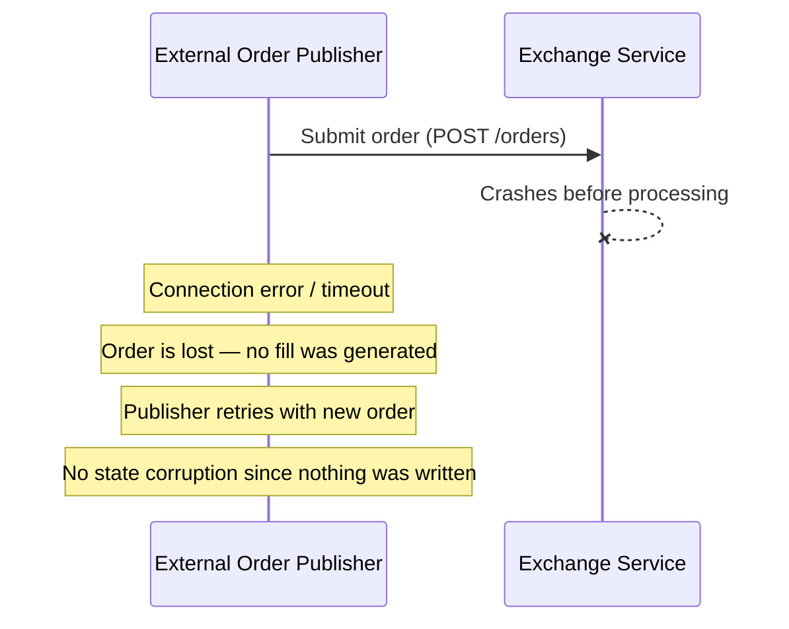
```mermaid
sequenceDiagram
  participant user as External Order Publisher
  participant exchange as Exchange Service
  user->>exchange: Submit order (POST /orders)
  exchange--xexchange: Crashes before processing
  Note over user: Connection error / timeout
  Note over user: Order is lost — no fill was generated
  Note over user: Publisher retries with new order
  Note over user: No state corruption since nothing was written
```
**Outcome:** The order is simply lost. No fill was created, no position changed, and no exposure was affected. The external order publisher can retry by submitting a new order. Since the order never reached the matching engine, there is no risk of duplicate fills or inconsistent state.

---

### Error Case 2: Exchange goes down after sending the fill but before confirming to the publisher
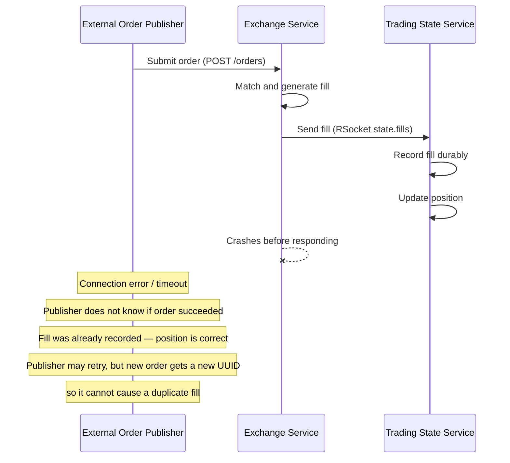
```mermaid
sequenceDiagram
  participant user as External Order Publisher
  participant exchange as Exchange Service
  participant state as Trading State Service
  user->>exchange: Submit order (POST /orders)
  exchange->>exchange: Match and generate fill
  exchange->>state: Send fill (RSocket state.fills)
  state->>state: Record fill durably
  state->>state: Update position
  exchange--xexchange: Crashes before responding
  Note over user: Connection error / timeout
  Note over user: Publisher does not know if order succeeded
  Note over user: Fill was already recorded — position is correct
  Note over user: Publisher may retry, but new order gets a new UUID
  Note over user: so it cannot cause a duplicate fill
```
**Outcome:** The fill was already sent to and recorded by the trading state service, so the position is correct. The publisher sees a timeout and doesn't know if the order succeeded. If it retries, the new order has a new UUID and is treated as a separate order — no duplication. The quote's remaining quantity was already decremented before the crash.

---

### Error Case 3: Trading state service goes down before handling the fill
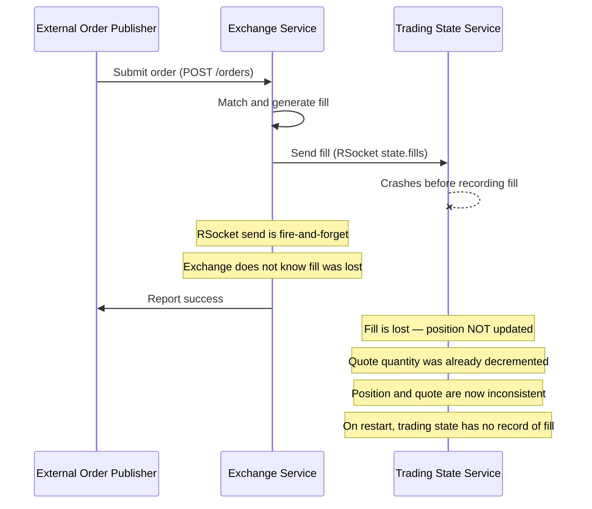
```mermaid
sequenceDiagram
  participant user as External Order Publisher
  participant exchange as Exchange Service
  participant state as Trading State Service
  user->>exchange: Submit order (POST /orders)
  exchange->>exchange: Match and generate fill
  exchange->>state: Send fill (RSocket state.fills)
  state--xstate: Crashes before recording fill
  Note over exchange: RSocket send is fire-and-forget
  Note over exchange: Exchange does not know fill was lost
  exchange->>user: Report success
  Note over state: Fill is lost — position NOT updated
  Note over state: Quote quantity was already decremented
  Note over state: Position and quote are now inconsistent
  Note over state: On restart, trading state has no record of fill
```
**Outcome:** This is a critical inconsistency. The exchange already decremented the quote's remaining quantity, but the fill was never recorded. The position does not reflect the trade. Since RSocket fire-and-forget provides no delivery guarantee, the fill is lost. The quote will eventually expire (30s TTL), releasing its exposure, and the market maker will publish a new quote based on the (stale) position. This represents a known gap — a more robust design would use at-least-once delivery with idempotent fill recording.

---

### Error Case 4: Order submitted against an expired quote
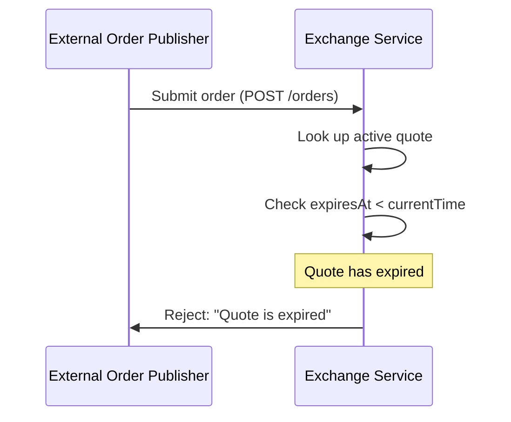
```mermaid
sequenceDiagram
  participant user as External Order Publisher
  participant exchange as Exchange Service
  user->>exchange: Submit order (POST /orders)
  exchange->>exchange: Look up active quote
  exchange->>exchange: Check expiresAt < currentTime
  Note over exchange: Quote has expired
  exchange->>user: Reject: "Quote is expired"
```
**Outcome:** The exchange checks `expiresAt` before matching. Expired quotes are never filled. The publisher receives a 400 error and may retry later when a fresh quote is available.

---

### Error Case 5: Order quantity exceeds remaining quote quantity
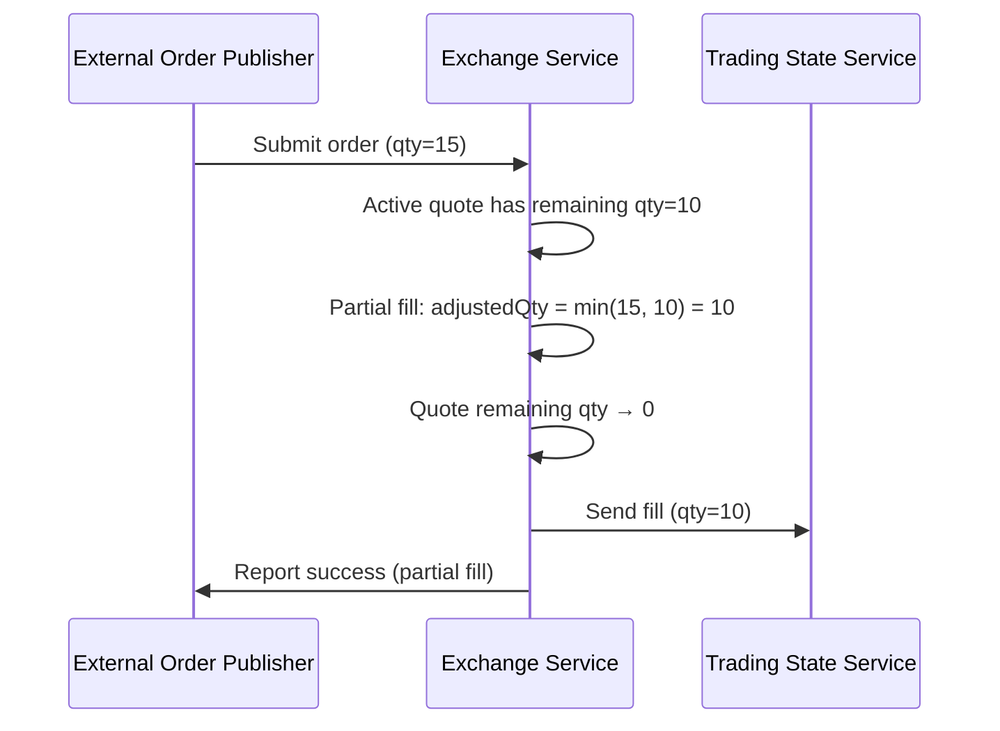
```mermaid
sequenceDiagram
  participant user as External Order Publisher
  participant exchange as Exchange Service
  participant state as Trading State Service
  user->>exchange: Submit order (qty=15)
  exchange->>exchange: Active quote has remaining qty=10
  exchange->>exchange: Partial fill: adjustedQty = min(15, 10) = 10
  exchange->>exchange: Quote remaining qty → 0
  exchange->>state: Send fill (qty=10)
  exchange->>user: Report success (partial fill)
```
**Outcome:** The order is partially filled against the remaining quote quantity. The fill reflects only the actually executed quantity. The quote's remaining quantity is decremented accordingly.

---

### Error Case 6: Concurrent orders race on same quote
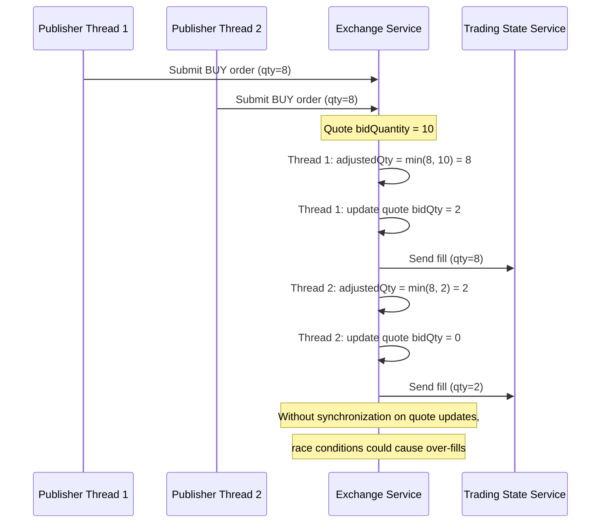
```mermaid
sequenceDiagram
  participant user1 as Publisher Thread 1
  participant user2 as Publisher Thread 2
  participant exchange as Exchange Service
  participant state as Trading State Service
  user1->>exchange: Submit BUY order (qty=8)
  user2->>exchange: Submit BUY order (qty=8)
  Note over exchange: Quote bidQuantity = 10
  exchange->>exchange: Thread 1: adjustedQty = min(8, 10) = 8
  exchange->>exchange: Thread 1: update quote bidQty = 2
  exchange->>state: Send fill (qty=8)
  exchange->>exchange: Thread 2: adjustedQty = min(8, 2) = 2
  exchange->>exchange: Thread 2: update quote bidQty = 0
  exchange->>state: Send fill (qty=2)
  Note over exchange: Without synchronization on quote updates,
  Note over exchange: race conditions could cause over-fills
```
**Outcome:** If the exchange does not synchronize access to the quote's remaining quantity, two concurrent orders could both read the same remaining quantity and over-fill. A non-atomic read-modify-write on the quote is a potential concurrency issue. Using locks or an atomic compare-and-swap would prevent this.

---

## Updating Quote

### Error Case 7: Market maker goes down before handling the position update
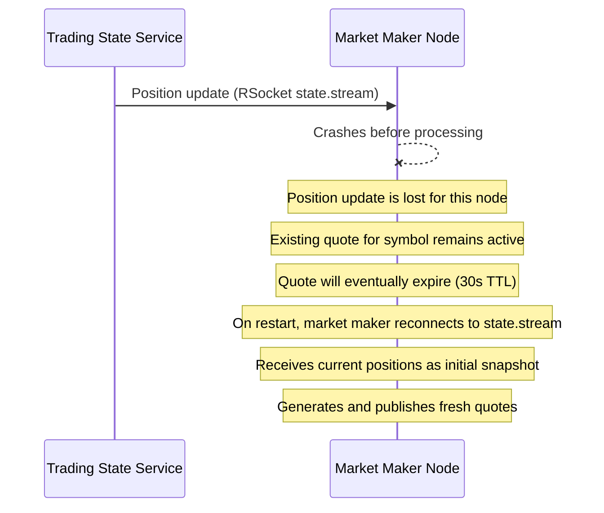
```mermaid
sequenceDiagram
  participant state as Trading State Service
  participant maker as Market Maker Node
  state->>maker: Position update (RSocket state.stream)
  maker--xmaker: Crashes before processing
  Note over maker: Position update is lost for this node
  Note over maker: Existing quote for symbol remains active
  Note over maker: Quote will eventually expire (30s TTL)
  Note over maker: On restart, market maker reconnects to state.stream
  Note over maker: Receives current positions as initial snapshot
  Note over maker: Generates and publishes fresh quotes
```
**Outcome:** The position update is lost for this market maker instance. The currently active quote (if any) continues until its TTL expires. When the market maker restarts, it reconnects to `state.stream`, receives the full current position snapshot, and resumes publishing quotes based on the latest committed state.

---

### Error Case 8: Market maker goes down after sending reservation but before sending new quote
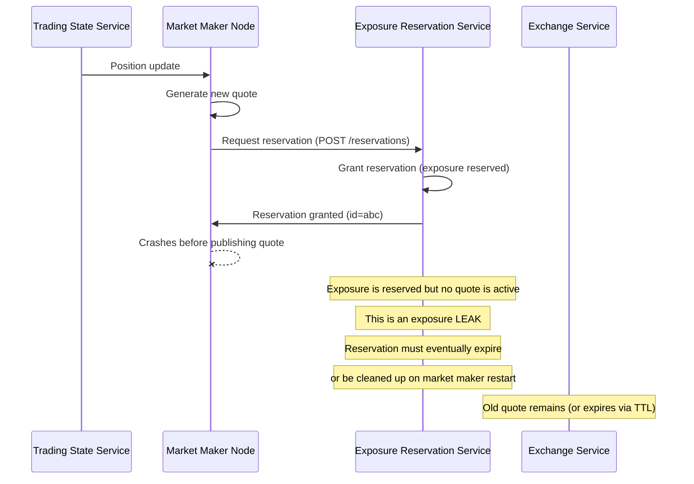
```mermaid
sequenceDiagram
  participant state as Trading State Service
  participant maker as Market Maker Node
  participant reservation as Exposure Reservation Service
  participant exchange as Exchange Service
  state->>maker: Position update
  maker->>maker: Generate new quote
  maker->>reservation: Request reservation (POST /reservations)
  reservation->>reservation: Grant reservation (exposure reserved)
  reservation->>maker: Reservation granted (id=abc)
  maker--xmaker: Crashes before publishing quote
  Note over reservation: Exposure is reserved but no quote is active
  Note over reservation: This is an exposure LEAK
  Note over reservation: Reservation must eventually expire
  Note over reservation: or be cleaned up on market maker restart
  Note over exchange: Old quote remains (or expires via TTL)
```
**Outcome:** Exposure capacity is reserved but never used — this is an exposure leak. The reservation stays active, reducing the available capacity for other quotes. The system needs a mechanism to handle this: either reservations should have their own TTL aligned with the quote TTL (30s), or the market maker must release orphaned reservations on restart.

---

### Error Case 9: Reservation service goes down before updating reservation
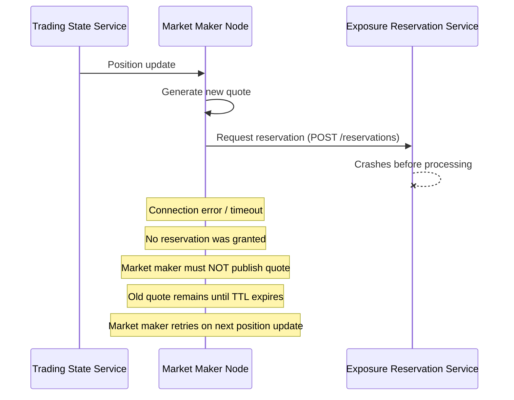
```mermaid
sequenceDiagram
  participant state as Trading State Service
  participant maker as Market Maker Node
  participant reservation as Exposure Reservation Service
  state->>maker: Position update
  maker->>maker: Generate new quote
  maker->>reservation: Request reservation (POST /reservations)
  reservation--xreservation: Crashes before processing
  Note over maker: Connection error / timeout
  Note over maker: No reservation was granted
  Note over maker: Market maker must NOT publish quote
  Note over maker: Old quote remains until TTL expires
  Note over maker: Market maker retries on next position update
```
**Outcome:** The market maker receives an error when trying to reserve exposure. Per the authority boundaries, a quote must not become active without a granted reservation. The market maker does not publish the quote. The old quote (if any) remains until it expires. On the next position update or refresh cycle, the market maker retries.

---

### Error Case 10: Exchange service goes down before updating quote
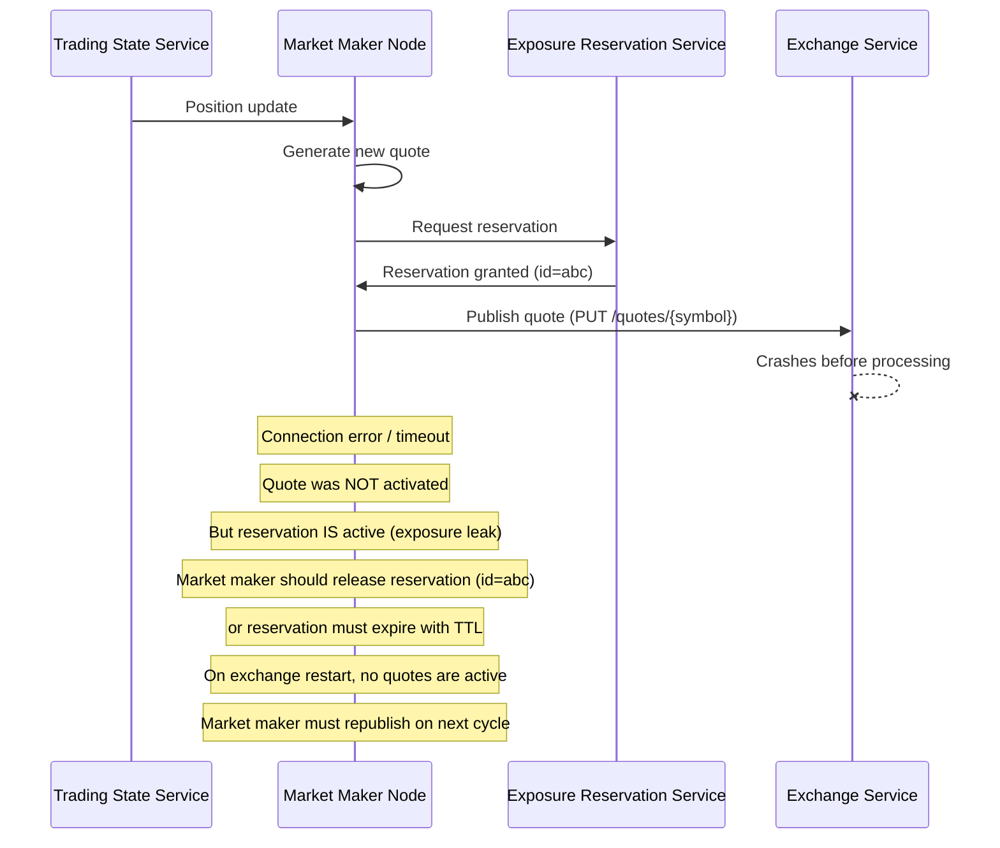
```mermaid
sequenceDiagram
  participant state as Trading State Service
  participant maker as Market Maker Node
  participant reservation as Exposure Reservation Service
  participant exchange as Exchange Service
  state->>maker: Position update
  maker->>maker: Generate new quote
  maker->>reservation: Request reservation
  reservation->>maker: Reservation granted (id=abc)
  maker->>exchange: Publish quote (PUT /quotes/{symbol})
  exchange--xexchange: Crashes before processing
  Note over maker: Connection error / timeout
  Note over maker: Quote was NOT activated
  Note over maker: But reservation IS active (exposure leak)
  Note over maker: Market maker should release reservation (id=abc)
  Note over maker: or reservation must expire with TTL
  Note over maker: On exchange restart, no quotes are active
  Note over maker: Market maker must republish on next cycle
```
**Outcome:** The reservation is granted but the quote never activates. The market maker should detect the failure and release the reservation. When the exchange restarts, it has no active quotes. The market maker will republish quotes on its next refresh cycle.

---

### Error Case 11: Reservation is partially granted
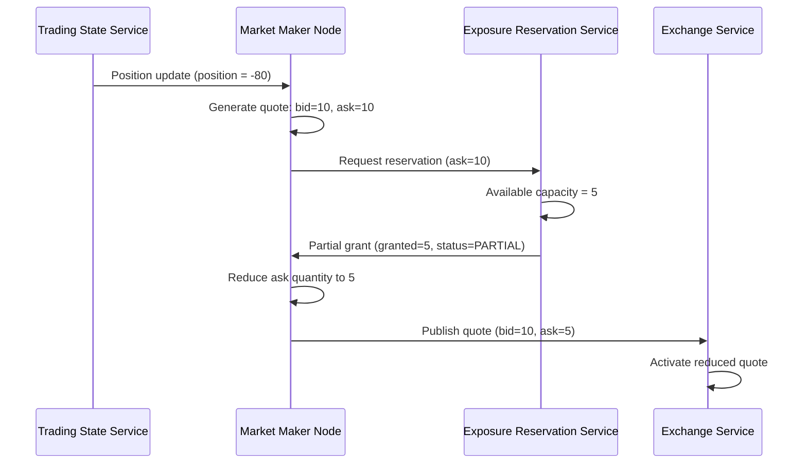
```mermaid
sequenceDiagram
  participant state as Trading State Service
  participant maker as Market Maker Node
  participant reservation as Exposure Reservation Service
  participant exchange as Exchange Service
  state->>maker: Position update (position = -80)
  maker->>maker: Generate quote: bid=10, ask=10
  maker->>reservation: Request reservation (ask=10)
  reservation->>reservation: Available capacity = 5
  reservation->>maker: Partial grant (granted=5, status=PARTIAL)
  maker->>maker: Reduce ask quantity to 5
  maker->>exchange: Publish quote (bid=10, ask=5)
  exchange->>exchange: Activate reduced quote
```
**Outcome:** When insufficient exposure capacity exists, the reservation service grants only what is available. The market maker deterministically reduces the quote quantity to match and publishes a smaller quote. This prevents exposure limit violations while still providing some liquidity.

---

### Error Case 12: Reservation denied entirely
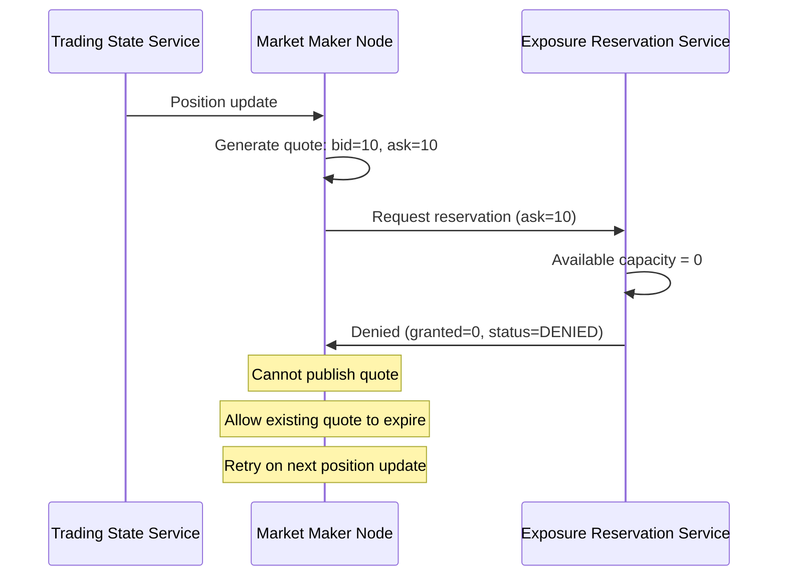
```mermaid
sequenceDiagram
  participant state as Trading State Service
  participant maker as Market Maker Node
  participant reservation as Exposure Reservation Service
  state->>maker: Position update
  maker->>maker: Generate quote: bid=10, ask=10
  maker->>reservation: Request reservation (ask=10)
  reservation->>reservation: Available capacity = 0
  reservation->>maker: Denied (granted=0, status=DENIED)
  Note over maker: Cannot publish quote
  Note over maker: Allow existing quote to expire
  Note over maker: Retry on next position update
```
**Outcome:** No exposure capacity is available. The market maker cannot publish a quote for this symbol. The existing quote (if any) expires naturally. The market maker will retry when it receives the next position update or when capacity becomes available.

---

### Error Case 13: Stale position update arrives after a newer one
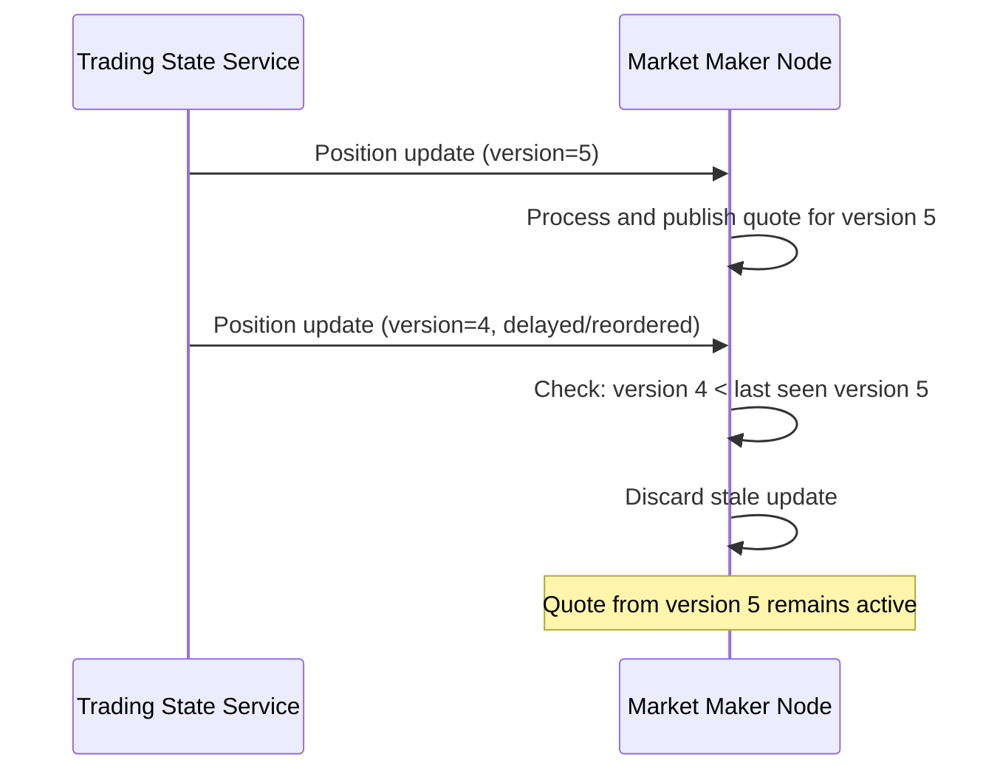
```mermaid
sequenceDiagram
  participant state as Trading State Service
  participant maker as Market Maker Node
  state->>maker: Position update (version=5)
  maker->>maker: Process and publish quote for version 5
  state->>maker: Position update (version=4, delayed/reordered)
  maker->>maker: Check: version 4 < last seen version 5
  maker->>maker: Discard stale update
  Note over maker: Quote from version 5 remains active
```
**Outcome:** The market maker tracks the last processed position version per symbol. Updates with older versions are discarded to prevent stale quotes from overriding newer state.

---

### Error Case 14: Quote expires before it can be refreshed
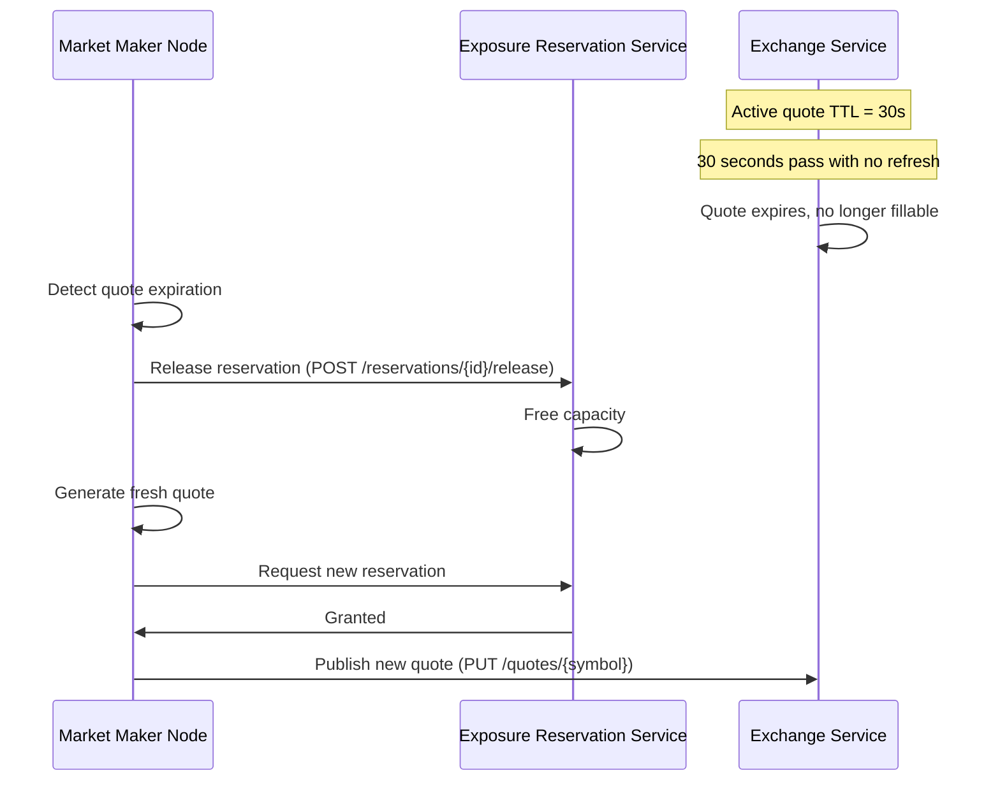
```mermaid
sequenceDiagram
  participant maker as Market Maker Node
  participant reservation as Exposure Reservation Service
  participant exchange as Exchange Service
  Note over exchange: Active quote TTL = 30s
  Note over exchange: 30 seconds pass with no refresh
  exchange->>exchange: Quote expires, no longer fillable
  maker->>maker: Detect quote expiration
  maker->>reservation: Release reservation (POST /reservations/{id}/release)
  reservation->>reservation: Free capacity
  maker->>maker: Generate fresh quote
  maker->>reservation: Request new reservation
  reservation->>maker: Granted
  maker->>exchange: Publish new quote (PUT /quotes/{symbol})
```
**Outcome:** When a quote expires, the exchange stops filling it. The market maker must detect this and release the associated reservation, then publish a fresh quote. If the market maker fails to release, the capacity leaks until the reservation's own expiration mechanism triggers.

---

## Streaming Position Data Updates

### Error Case 15: Connected trading state service goes down
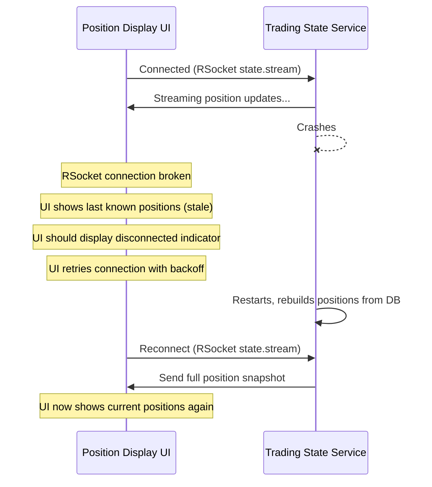
```mermaid
sequenceDiagram
  participant frontend as Position Display UI
  participant state as Trading State Service
  frontend->>state: Connected (RSocket state.stream)
  state->>frontend: Streaming position updates...
  state--xstate: Crashes
  Note over frontend: RSocket connection broken
  Note over frontend: UI shows last known positions (stale)
  Note over frontend: UI should display disconnected indicator
  Note over frontend: UI retries connection with backoff
  state->>state: Restarts, rebuilds positions from DB
  frontend->>state: Reconnect (RSocket state.stream)
  state->>frontend: Send full position snapshot
  Note over frontend: UI now shows current positions again
```
**Outcome:** The UI loses its real-time connection and shows stale data. It should indicate the disconnected state to the user and retry with exponential backoff. When the trading state service restarts, it rebuilds positions from PostgreSQL via Hazelcast MapStore. The UI reconnects and receives the full current snapshot.

---

## Exposure Lifecycle Errors

### Error Case 16: Fill arrives but reservation apply-fill fails
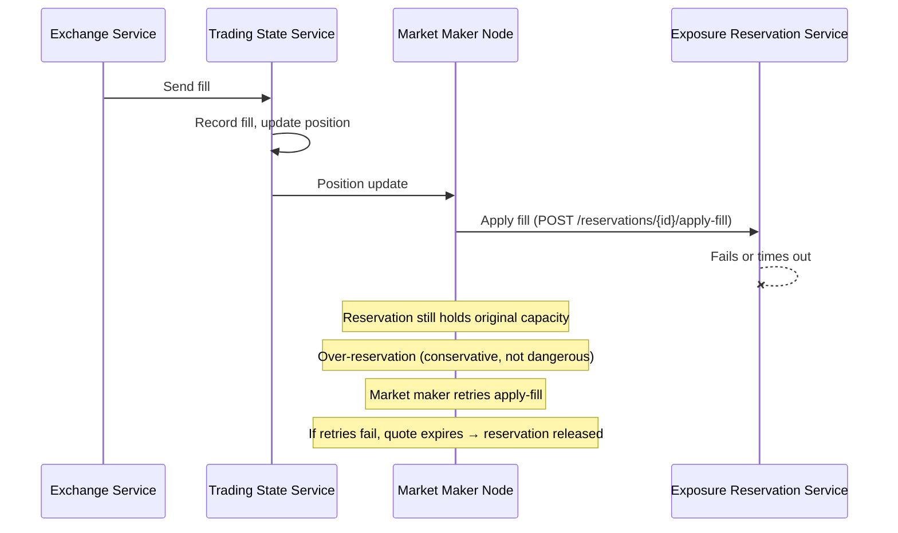
```mermaid
sequenceDiagram
  participant exchange as Exchange Service
  participant state as Trading State Service
  participant maker as Market Maker Node
  participant reservation as Exposure Reservation Service
  exchange->>state: Send fill
  state->>state: Record fill, update position
  state->>maker: Position update
  maker->>reservation: Apply fill (POST /reservations/{id}/apply-fill)
  reservation--xreservation: Fails or times out
  Note over maker: Reservation still holds original capacity
  Note over maker: Over-reservation (conservative, not dangerous)
  Note over maker: Market maker retries apply-fill
  Note over maker: If retries fail, quote expires → reservation released
```
**Outcome:** The reservation still holds the original (pre-fill) capacity. This is a conservative over-reservation — it wastes capacity but does not violate the exposure limit. The market maker should retry. Even if retries fail, the quote eventually expires and the reservation is released.

---

### Error Case 17: Market maker crashes during quote replacement cycle
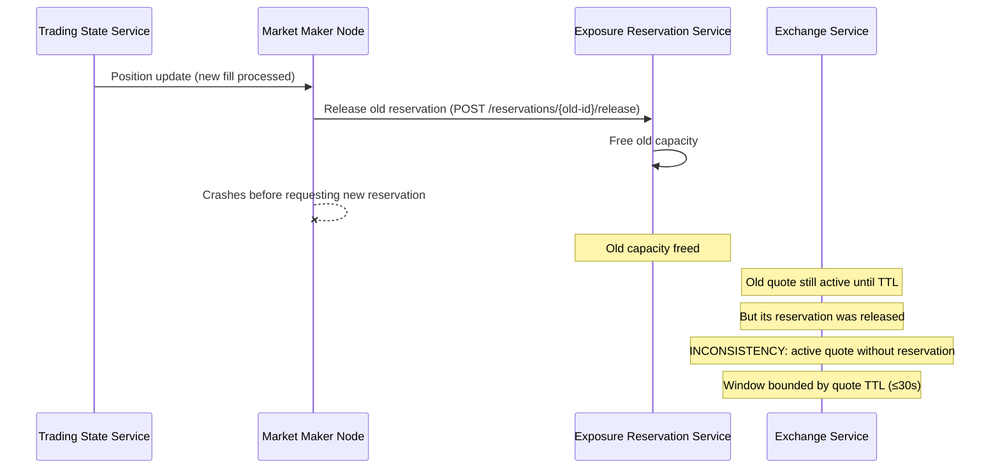
```mermaid
sequenceDiagram
  participant state as Trading State Service
  participant maker as Market Maker Node
  participant reservation as Exposure Reservation Service
  participant exchange as Exchange Service
  state->>maker: Position update (new fill processed)
  maker->>reservation: Release old reservation (POST /reservations/{old-id}/release)
  reservation->>reservation: Free old capacity
  maker--xmaker: Crashes before requesting new reservation
  Note over reservation: Old capacity freed
  Note over exchange: Old quote still active until TTL
  Note over exchange: But its reservation was released
  Note over exchange: INCONSISTENCY: active quote without reservation
  Note over exchange: Window bounded by quote TTL (≤30s)
```
**Outcome:** There is a brief window where an active quote exists without a backing reservation. This violates the invariant that every active quote must have a reservation. The window is bounded by the quote's TTL (≤30 seconds). A safer approach would be to request the new reservation before releasing the old one.

---

## Full System Restart

### Error Case 18: Recovery after full system restart
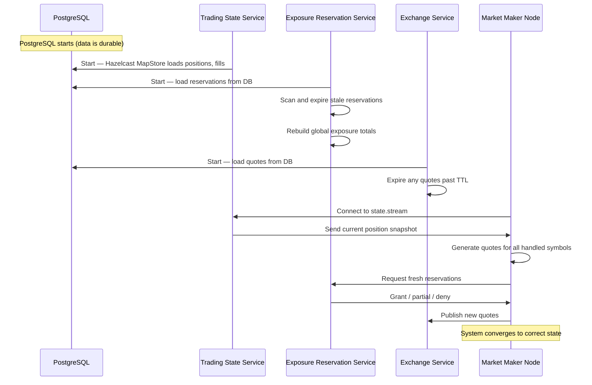
```mermaid
sequenceDiagram
  participant pg as PostgreSQL
  participant state as Trading State Service
  participant reservation as Exposure Reservation Service
  participant exchange as Exchange Service
  participant maker as Market Maker Node
  Note over pg: PostgreSQL starts (data is durable)
  state->>pg: Start — Hazelcast MapStore loads positions, fills
  reservation->>pg: Start — load reservations from DB
  reservation->>reservation: Scan and expire stale reservations
  reservation->>reservation: Rebuild global exposure totals
  exchange->>pg: Start — load quotes from DB
  exchange->>exchange: Expire any quotes past TTL
  maker->>state: Connect to state.stream
  state->>maker: Send current position snapshot
  maker->>maker: Generate quotes for all handled symbols
  maker->>reservation: Request fresh reservations
  reservation->>maker: Grant / partial / deny
  maker->>exchange: Publish new quotes
  Note over maker: System converges to correct state
```
**Outcome:** After a full restart, each service rebuilds from durable storage (PostgreSQL via Hazelcast MapStore). The exposure reservation service must scan for and expire stale reservations to prevent leaked capacity. The exchange expires old quotes. Market makers reconnect, receive current positions, and republish quotes. The system converges without manual intervention.
