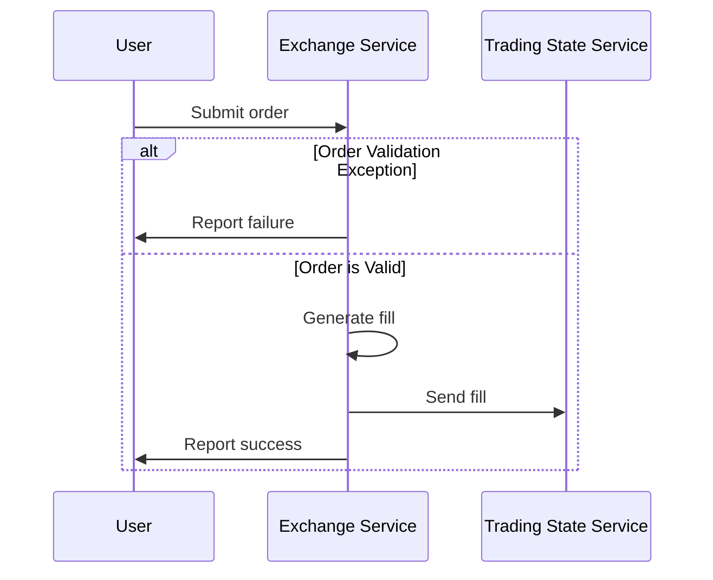
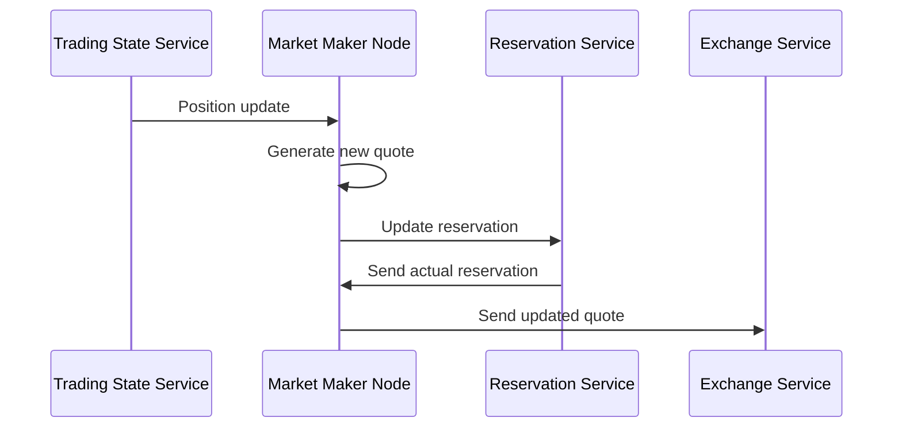

# Workflows

## Submitting External Orders

```mermaid
sequenceDiagram
  participant user as User
  participant exchange as Exchange Service
  participant state as Trading State Service
  user->>exchange: Submit order
  alt Order Validation Exception
    exchange->>user: Report failure
  else Order is Valid
    exchange->>exchange: Generate fill
    exchange->>state: Send fill
    exchange->>user: Report success
  end
```

## Updating Quote

```mermaid
sequenceDiagram
  participant state as Trading State Service
  participant maker as Market Maker Node
  participant reservation as Reservation Service
  participant exchange as Exchange Service
  state->>maker: Position update
  maker->>maker: Generate new quote
  maker->>reservation: Update reservation
  reservation->>maker: Send actual reservation
  maker->>exchange: Send updated quote
```
