# Workflows

## Submitting External Orders
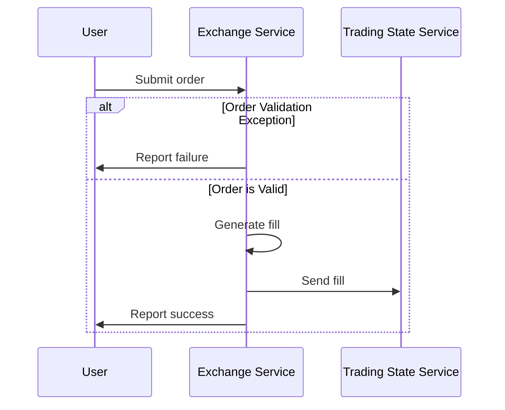

### Order submitted against an expired quote
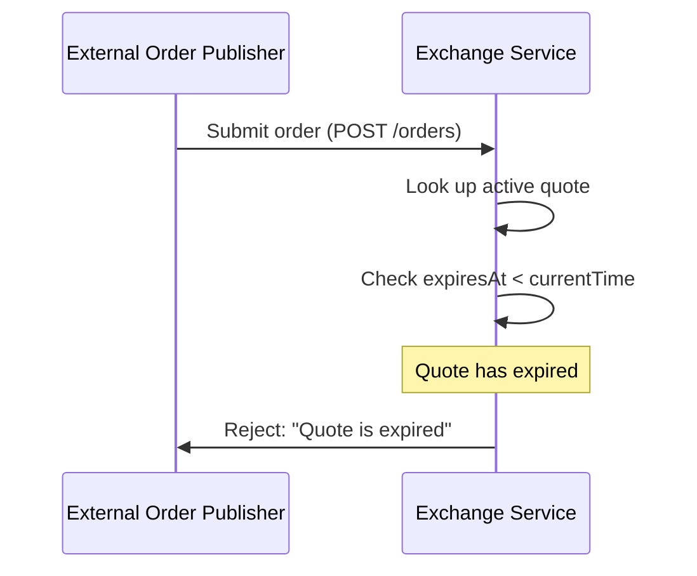
**Outcome:** The exchange checks `expiresAt` before matching. Expired quotes are never filled. The publisher receives a 400 error and may retry later when a fresh quote is available.

### Order quantity exceeds remaining quote quantity (partial fill)
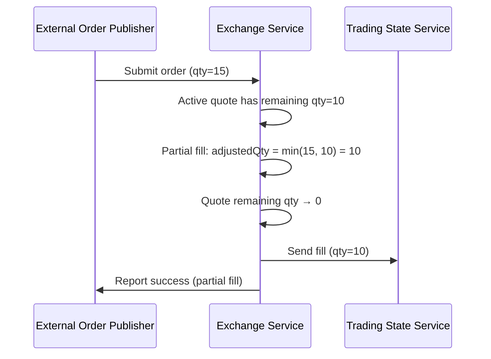
**Outcome:** The order is partially filled against the remaining quote quantity. The fill reflects only the actually executed quantity. The quote's remaining quantity is decremented accordingly.

### Concurrent orders on same quote
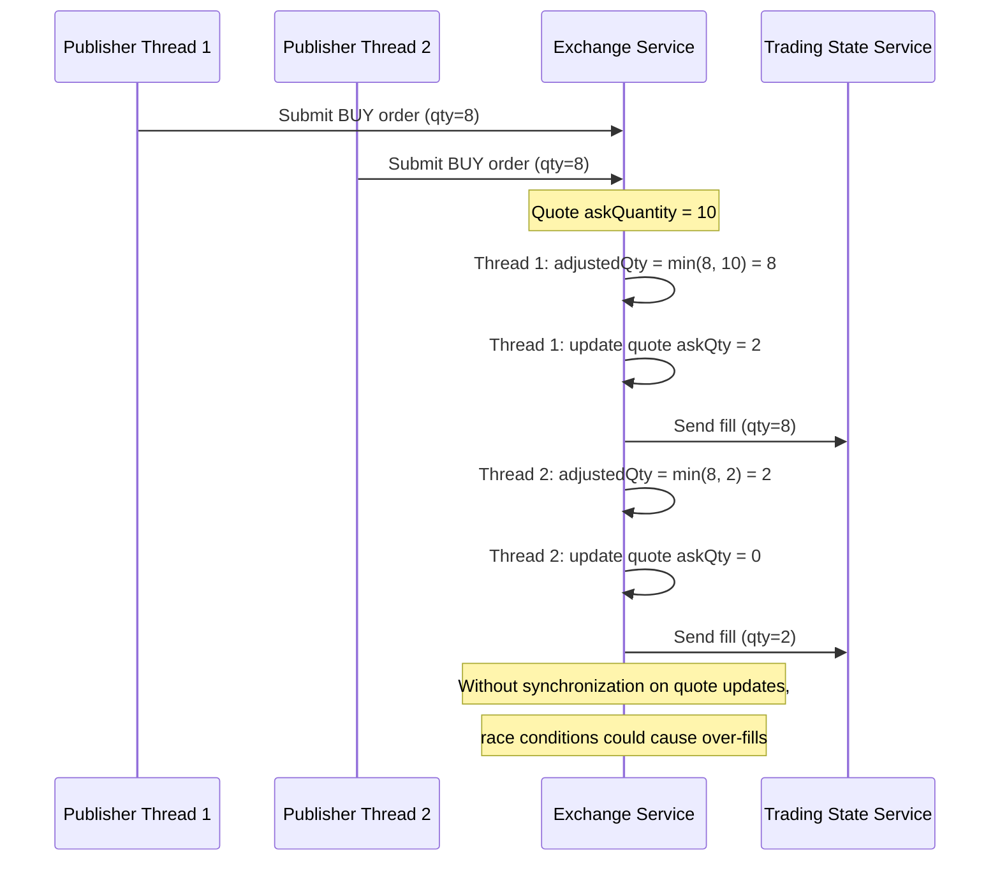
**Outcome:** If the exchange does not synchronize access to the quote's remaining quantity, two concurrent orders could both read the same remaining quantity and over-fill. Proper locking or atomic operations on the quote are needed to prevent this.

---

## Updating Quote
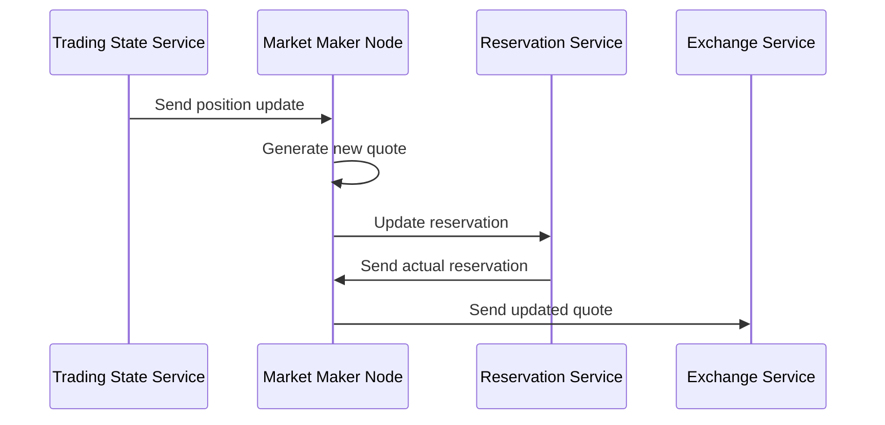

### Reservation is partially granted
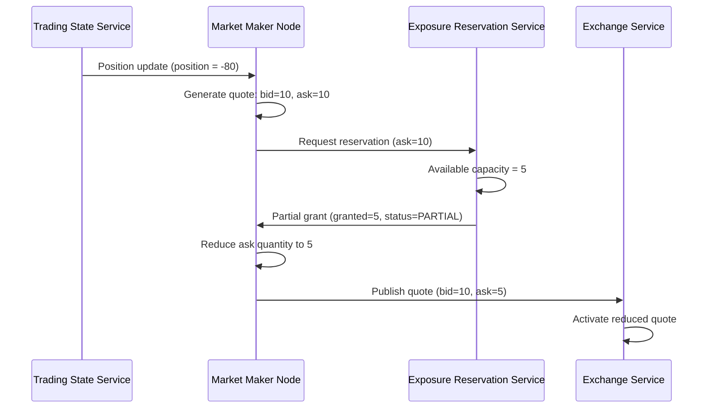
**Outcome:** When insufficient exposure capacity exists, the reservation service grants only what is available. The market maker deterministically reduces the quote quantity to match and publishes a smaller quote. This prevents exposure limit violations while still providing some liquidity.

### Reservation denied entirely
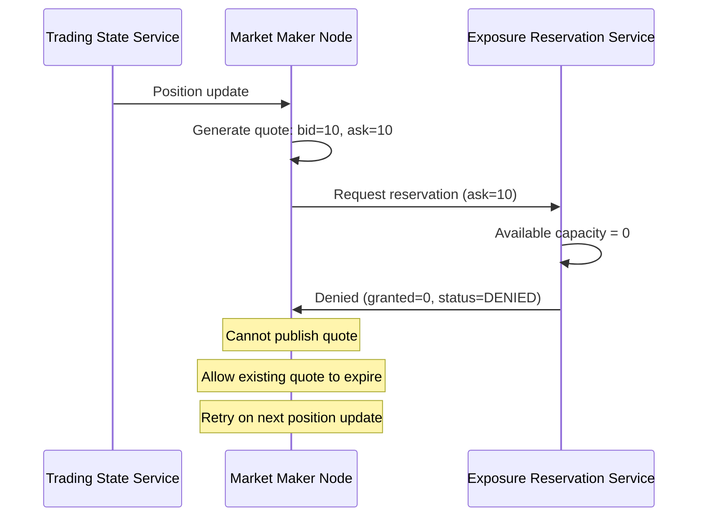
**Outcome:** No exposure capacity is available. The market maker cannot publish a quote for this symbol. The existing quote (if any) expires naturally. The market maker will retry when it receives the next position update or when capacity becomes available.

### Stale position update arrives after a newer one
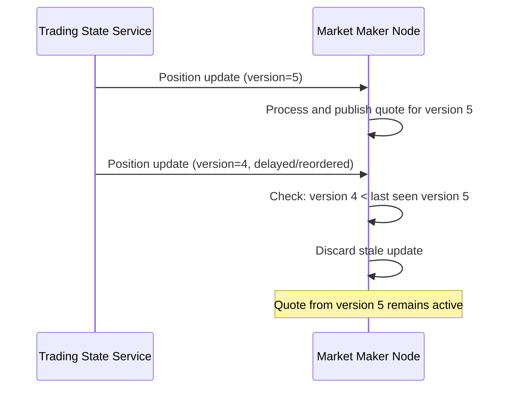
**Outcome:** The market maker tracks the last processed position version per symbol. Updates with older versions are discarded to prevent stale quotes from overriding newer state.

### Quote expires before it can be refreshed
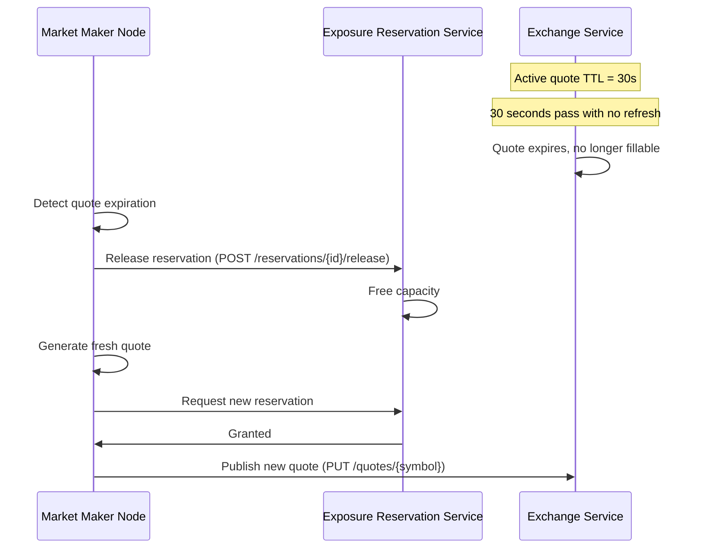
**Outcome:** When a quote expires, the exchange stops filling it. The market maker detects this and releases the associated reservation, then publishes a fresh quote. This is normal lifecycle behavior.

---

## Streaming Position Data Updates
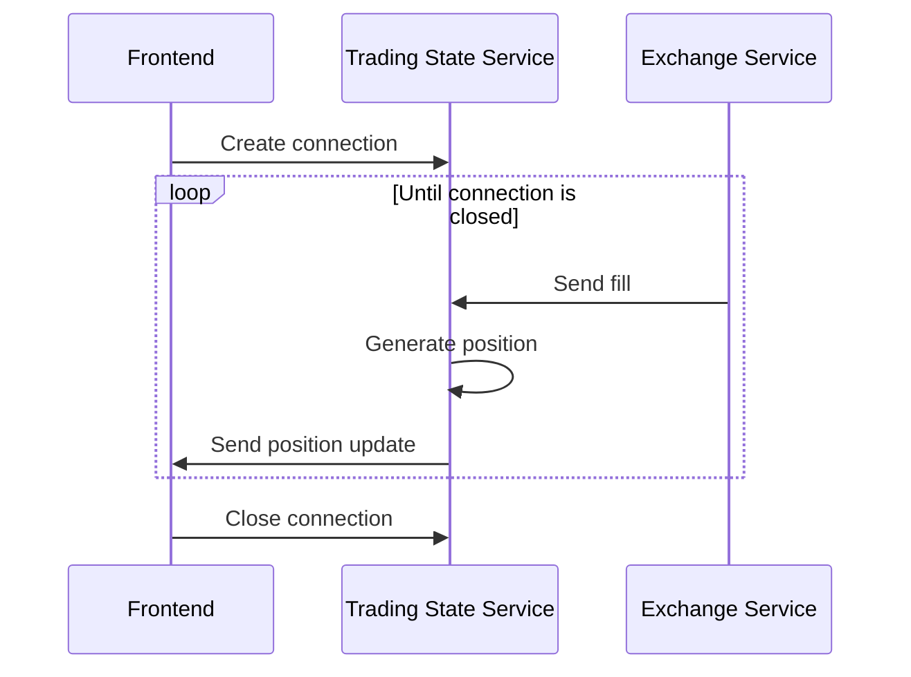

### UI connects but no positions exist yet
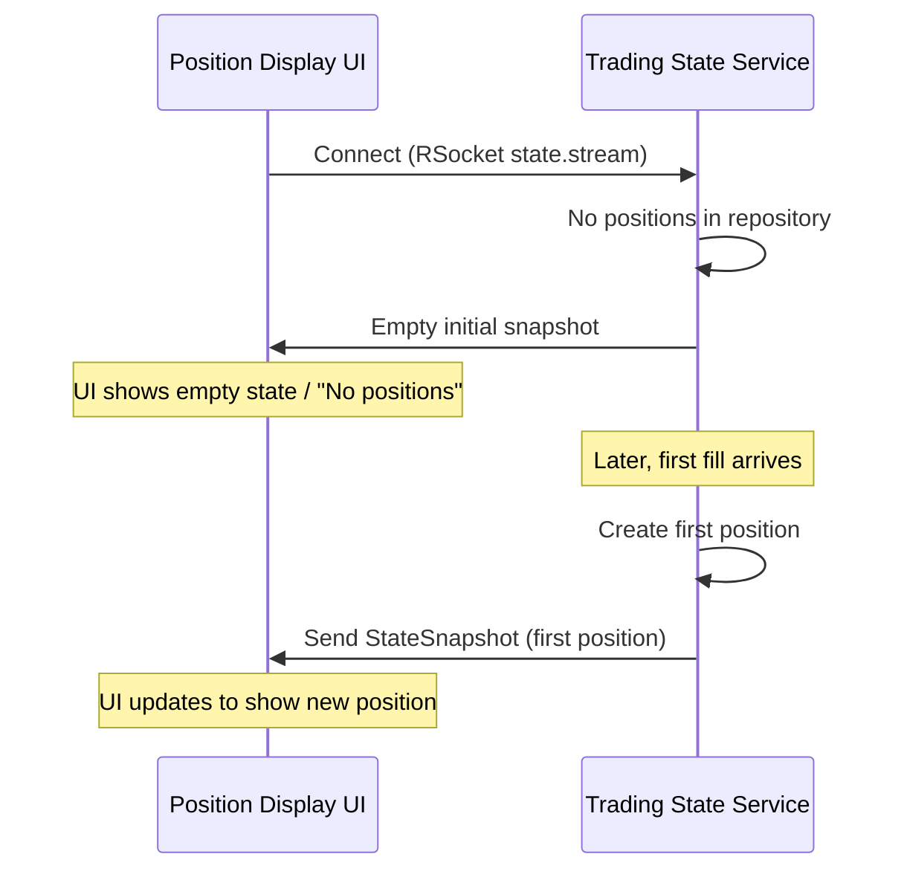
**Outcome:** The UI handles the empty state gracefully and updates dynamically as positions are created.

### Multiple UI clients connected simultaneously
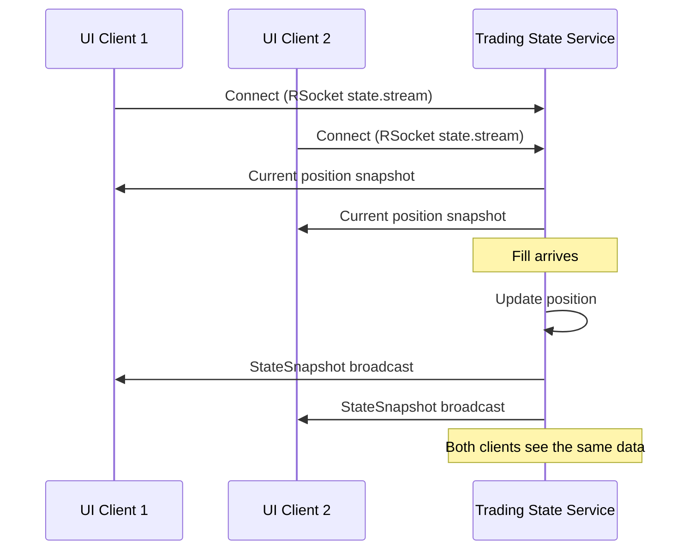
**Outcome:** The multicast sink broadcasts to all connected subscribers. All UI clients see consistent, real-time position data.
